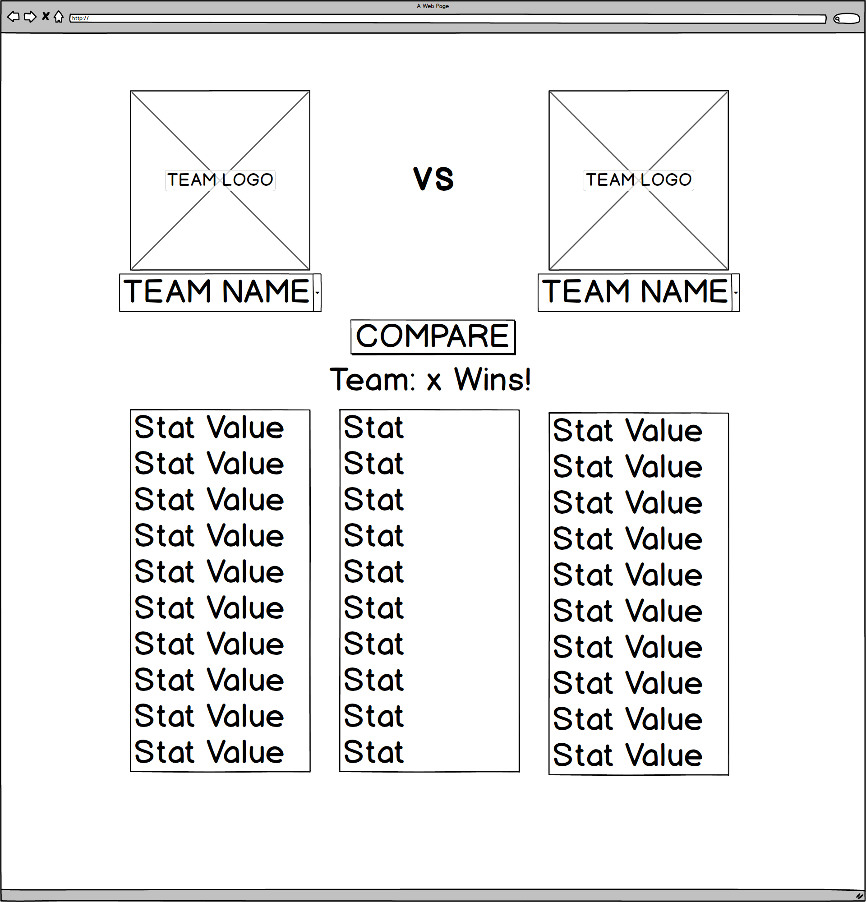
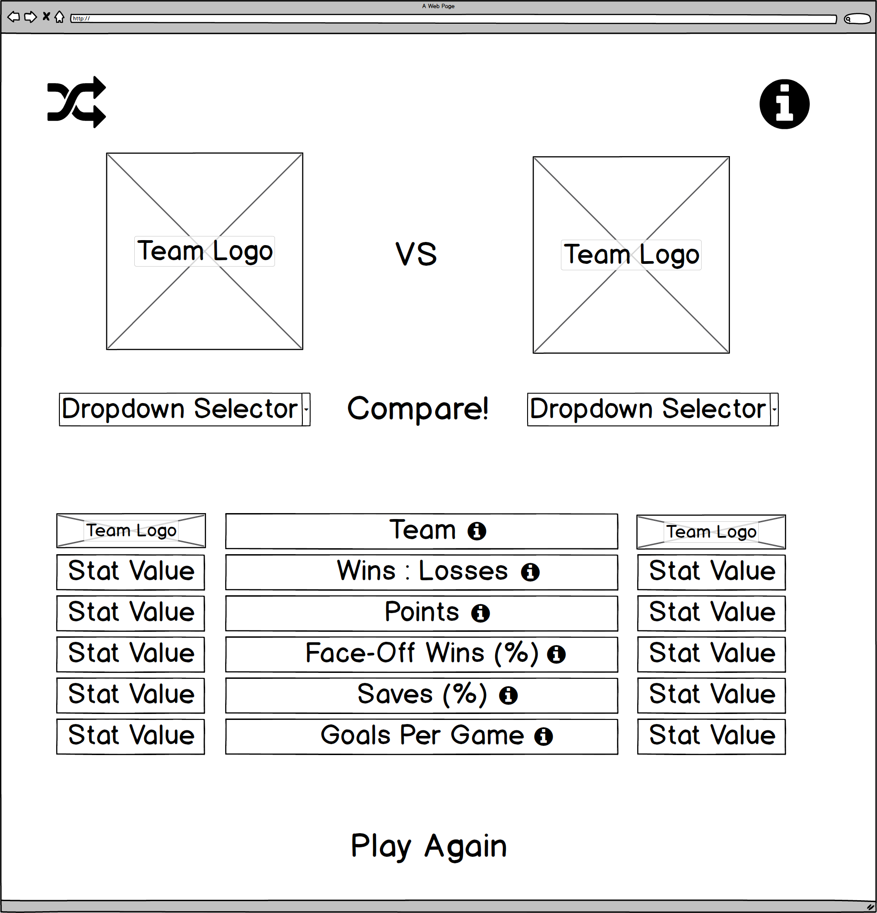
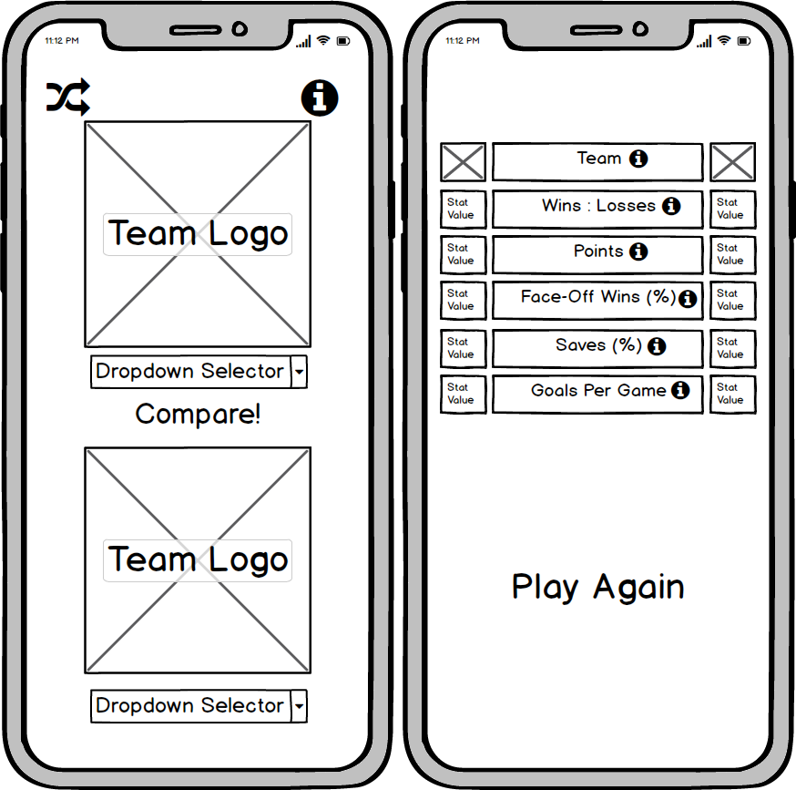
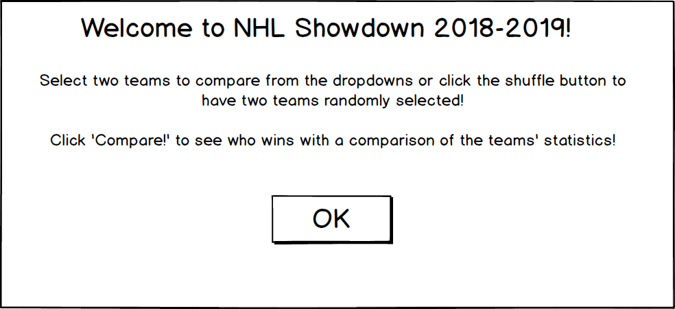
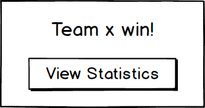

# NHL Team Showdown
View the live deployment [here](https://elliotredhead.github.io/NHL-TeamVersus/)
-----
Submission for Code Institute's Interactive Frontend Development Milestone Project, a one-page site to compare National Hockey League statistics between two teams.
This recreational/educational tool is designed to easily allow comparison of key statistics for the 2018/2019 season with a breakdown of these in a fun game-like format.

## User Experience
 
#### The target audience for this website is: 
* NHL fans that want to compare team statistics.

#### This project is the best way to deliver the content because:
* It is interactive, with the aim of delivering the statistics in a fun, animated way.
* It is fully-responsive, enabling use across a range of resolutions.
* The layout is intuitive, detailed instructions would not be required for the average user to access and use the site.
*

## User Stories

1. A user wanting to conduct a statistics comparison between two specific different teams.
2. A user interested in comparing two random teams.

### User Story Fulfilment

1. Activating each team selector dropdown provides lists of teams as input options, the two different teams can be selected from each.  
Upon selection of both valid teams; the compare button appears, ensuring the user is certain of their choice before manual confirmation.  
Upon clicking the "Compare!" prompt the winner is announced in an alert messagebox, proceeding by click the "View Statistics" button in the alert modal displays the statistics for both teams.  
The respective value for each attribute that each team has won/lost/drawn for are displayed and highlighted with different colours for greater contrast.  
Hovering over the tooltip for each statistic descriptor gives a brief explanation of each, if the user does not completely understand these they are now equipped with enough keywords to research further if interested in doing so.  
The "Play Again" prompt at the bottom of the screen allows the user to start again and hides the previous statistics.  
Alternatively, the user can manually scroll back to the dropdown selectors and manually change one or both options, or clicking the shuffle icon, this will result in the previous statistics being hidden to prevent potential confusion.

2. Clicking the shuffle icon results in the random selection of two valid teams; the compare button appears, allowing the user to review the team choices before manual confirmation.  
Upon clicking the "Compare!" prompt the winner is announced in an alert messagebox, proceeding by click the "View Statistics" button in the alert modal displays the statistics for both teams.  
The respective value for each attribute that each team has won/lost/drawn for are displayed and highlighted with different colours for greater contrast.  
Hovering over the tooltip for each statistic descriptor gives a brief explanation of each, if the user does not completely understand these they are now equipped with enough keywords to research further if interested in doing so.  
The "Play Again" prompt at the bottom of the screen allows the user to start again and hides the previous statistics.  
Alternatively, the user can manually scroll back to the dropdown selectors and manually change one or both options, or clicking the shuffle icon again, this will result in the previous statistics being hidden to prevent potential confusion.  

## Wireframes  

### Project Inception Wireframe  
The layout and functionality for this project has progressed since its inception, with the layout originally going to be kept constant across all resolutions.  
The core concept has been retained, with the purpose of team comparisons with a winner defined by statistical analysis.  


### Desktop Wireframe  
The addition of the function to randomize team selections resulted in introduction of the *shuffle* button, a similar addition was the manual trigger button for the welcome modal denoted by a larger information button.  
Smaller information icons were also added to the layout during development to provide optional tooltips for the user.
The better spacing of the statistics descriptors and values provided better contrast and separation of numbers for legibility.  
The *Play Again* feature was also devised at a later stage to enable better user guidance.  
  

### Mobile Wireframe  
The layout designed for the desktop version was not as suitable for resolutions below general tablet sizes, to enable easier selection of options and better visual feedback a re-design was required.  
The *VS* text was removed to allow the main functionality of the page to take precedence, in turn this provided space for a more impactful layout with improved ease-of-use with the larger selection dropdowns and buttons.  
The decision to display the selected teams' logos in a vertical layout also results in a tool that is both easier to navigate and interact with on a mobile-scale.  
  

### Welcome Modal Wireframe  
Upon loading of the page the user is greeted by a simple introduction with basic instructions for using the site, this can be manually re-triggered by either refreshing the page or selection the large information button.
  

### Winner Declaration Modal Wireframe  
Triggering the comparison of the two target teams results in a modal displaying the winning team's name. Proceeding with the modal button closes the modal message and automatically shows the statistics breakdown.  
  

## Features

### Existing Features

#### Welcome Modal
The welcome modal gives a brief instruction to the user of how to operate the comparison tool, explaining both the manual selection and random selection functions.

#### Team Selection Dropdowns
The dropdown selectors allow the user to select the teams that they want to compare, they  function to pass the user selection to other processes but are styled to keep with the competitive but fun theme of the page.

#### Dynamic Team Logos
The team logo above the team selector dropdown changes dynamically based on the team chosen, for example if the team "Anaheim Ducks" is selected from the dropdown: the Anaheim Ducks team logo appears above. This also serves as feedback to the user that their selection has been correctly assigned.

#### Shuffle Button
The well-established icon for shuffling a selection is used in a button at the top of the page, this randomly selects two teams for the user to compare. The user can repeatedly shuffle the selected teams as many times as they like. The same team cannot be compared against itself and the shuffle function does not allow the same team to be randomly chosen for both dropdown selectors.

#### Compare Button
The compare button gives the user the ability to trigger the statistics comparison when they have selected the teams they want to match against each other. If the user were to accidentally pick the wrong team from the list, they have the ability to correct their selection before triggering the comparison.

#### Dynamic Background Size
Upon triggering the comparison of the two teams; the background size enlarges to fill the newly displayed statistics section, this ensure continuity and adds dramatic effect by "focusing" closer.

#### Winner Declaration Modal
The winning team is stated using a sweetalerts modal box, this informs the user which team has won before the statistics are shown.

#### Statistics Lists
The statistics lists illustrate a breakdown of the attributes that have been used to compare these teams. They provide a user an idea of the factors that have been considered in the decision of the winner and highlighted in respective positive/neutral/negative colours to indicate their win/draw/loss state.

#### Statistic Descriptors
Tooltips give a brief description of each of the factors that are used to decide which team has won. They are described using as non-technical language as possible to also be accessible to people new to the sport.

#### Restart Button
Upon accessing the statistics portion of the page a button labelled "Play Again" is also displayed. Upon clicking this, the page is reset to its initial state for the user to pick teams again.

### Potential Features to Implement

The following are suggested additions that would exceed the project time constraints or require inaccessible resources but that would provide additional value to the project.

#### Determination of a Statistical Weighting for Each Statistic 
* Does a greater face-off win percentage provide a greater statistical value than a greater save percentage? 
* Does an average goal per game outweigh greater values of both of the above factors?
These are difficult factors to quantify a weighting between, as outliers in data and variation between players can influence the overall value. A situational example of this being that a specific team may have a couple of their strongest players taking the face-offs, resulting in a much greater face-off win percentage than is reflected in the overall team performance.

#### Adaptation to Season Changes
As new teams are formed, (for example a new Seattle team in the process of formation at the time this project was made) or team logos are adjusted; these adjustments could be made to the project with maintenance updates. The start of a new season also results in not enough current data to make comparisons, especially with players often changing between teams or rule changes being made between seasons. For this reason, this project has been isolated to the completed 2018/2019 season for evaluation purposes.

#### Visual Charting of Statistics & Trend Predictions
An idea originally contemplated for this project was to display a comparison of the selected statistics over the season for the selected teams, this however is not appropriate for the arcade-style of this particular page but if it were evolved into a larger-scale tool this could be suitable for the prediction of trends.

#### Mini-Game Counter
Addition of a mini-game wherein the user was provided with two teams and they were to choose which they thought would win, with their score dependent on their streak of correct choices.

## Technologies Used

* HTML.
* CSS.
* Javascript.
* [jQuery](https://jquery.com/) is primarily used within this project for ease of DOM manipulation.
* [Bootstrap](https://getbootstrap.com) is used for resolution responsiveness and for general structuring of the UI.
* [Git](https://git-scm.com/) is used for the version control of this project.
* [Font Awesome](https://fontawesome.com/) provides the shuffle and information icons (used for both the welcome trigger and tooltips).
* [Google Fonts](https://fonts.google.com/) is used to supply the main font for the majority of this website, the font sourced in this way is ["Teko"](https://fonts.google.com/specimen/Teko).
* [SweetAlert2](https://sweetalert2.github.io/) is used for both the welcome and winning announcement modals on this site.
* The [NHL API](https://statsapi.web.nhl.com/api/v1/teams/) is accessed for the teams' data, the public documentation for its use can be found [here](https://gitlab.com/dword4/nhlapi).

## Testing

1. Navigation (Larger Resolution)

2. Navigation (Smaller Resolution)

3. Team Selection Functionality

The dropdown selector successfully only allows selection of two teams that are different from one another and does not allow selection of the "Select Team" disabled option. Upon satisfying this criteria, a button to trigger the comparison appears.

4. The "Shuffle" Button

Upon clicking the shuffle/randomize button: two teams are randomly selected from the list but these teams must also not be identical to each other as identical teams cannot be compared.
If the initial randomization results in identical teams then one is re-randomized until the teams are different from one another.
This feature was extensively tested at [this commit](https://github.com/ElliotRedhead/NHL-TeamVersus/tree/6c4c3e2ce69c132fc0e55879e70b26478a0d8447) with a console message displayed each time the re-randomization was required and triggered.

5. Calculating the Winner

Comparison of the two teams "Philadelphia Flyers" and "New Jersey Devils" correctly announces that Philadelphia Flyers has won the statistics comparison in a modal. Greater/lesser statistics are correctly highlighted in the appropriate column with the tied save percentage statistic highlighted yellow for both teams. Reversing the team positions in the dropdown order yields the same correct result.
Comparison of the two teams "Toronto Maple Leafs" and "Pittsburgh Penguins" correctly announces that the teams have tied, the statistics correctly colours the greater/lesser statistics with an even spread of won statistics for both teams with a single tie.

6. Statistics Tooltips

7. The "Play Again" Button

Open the completed website across multiple devices and platforms, including Windows (Chrome), Linux (Chromium), Apple Mac (Safari), Apple iPhone (Safari) and Android Galaxy (Samsung Internet). Does the page load correctly and as was designed across target resolutions?

Use the [W3C](https://www.w3.org/) validators at the project's end and make adjustments if required, in accordance with the results.

### Known Bugs & Limitations

1. With the statistics list already generated, if using a browser compatibility tool to check layout across resolutions the team logos in the statistics list will be an incorrect size. This is fixed by re-comparing the teams at the chosen test resolution. This layout bug does not affect standard use of the site, and is known to be present across other popular websites i.e. Facebook.

2. As a new season starts there are insufficient statistics for the teams to determine a winner, with the potential introduction of new teams or change in team logos over time this project has been limited to the 2018/2019 season to ensure functionality persists.

## Deployment

This project was developed using Visual Studio Code, and was both committed to git and pushed to GitHub using the integrated source control feature.

The setup for the GitHub Pages deployment was as follows:
- Log into Github.
- Select the target repository from the list.
- Select "Settings" from the menu items.
- Scroll to the Github Pages section.
- Under "Source" click the drop-down that is set to "None" and select "Master Branch".
- The link to the website is now displayed under the "Github Pages" section.

At the time of submission are both the deployed and development versions of this project identical?

## Run this Project Locally:

1. Open [the repository](https://github.com/ElliotRedhead/NHL-TeamVersus) in GitHub
2. Select the green "Clone or download" button.
3. Copy the clone URL for this repository.
4. In your local IDE open Git Bash.
5. Navigate to where the cloned directory should reside, make this the current working directory.
6. Type "git clone", and paste the clone URL.

```git clone https://github.com/ElliotRedhead/NHL-TeamVersus.git```

7. Press Enter.
8. The local clone is now created.

## Credits

### Media
The photos used in this site were obtained from the following sources:
1. Helmet favicon: From [flaticon](https://www.flaticon.com/) from the [smashicon authors](https://www.flaticon.com/authors/smashicons).
2. Background image: Scratched ice background sourced from [pixabay](https://pixabay.com/photos/ice-ice-hockey-scratch-color-4285443/).

### Acknowledgements

Many thanks for support in the creation of this website to my mentor: [Simen Daehlin](https://github.com/Eventyret).